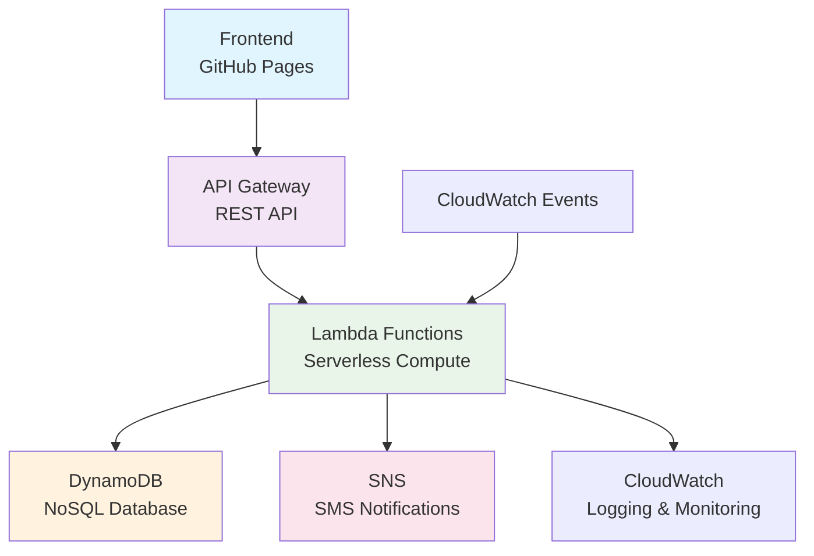

# 💊 Medication Reminder App

A modern web application for managing medication schedules, tracking adherence, and receiving reminders. Built with AWS serverless architecture and deployed on GitHub Pages.


## 🚀 Live Demo

**[https://yourusername.github.io/medication-reminder-app](https://yourusername.github.io/medication-reminder-app)**

## ✨ Features

- **📅 Medication Schedule** - View all medications with dosages and timing
- **🔔 Smart Reminders** - Automatic notifications for medication times
- **📝 Medication Logging** - Track taken, missed, or skipped doses
- **➕ Add New Medications** - Easy form to add new prescriptions
- **📱 Responsive Design** - Works perfectly on desktop, tablet, and mobile
- **🌐 Timezone Support** - Handles medications across different timezones
- **📊 Compliance Tracking** - Monitor medication adherence over time

## 🛠️ Technology Stack

### Frontend
- **HTML5** - Semantic markup
- **CSS3** - Modern styling with Flexbox/Grid
- **JavaScript (ES6+)** - Async/await, Fetch API
- **Responsive Design** - Mobile-first approach

### Backend (AWS Serverless)
- **AWS Lambda** - Serverless compute
- **API Gateway** - REST API endpoints
- **DynamoDB** - NoSQL database
- **SNS** - SMS notifications
- **CloudWatch** - Logging and monitoring

## 📋 API Endpoints

| Method | Endpoint | Description |
|--------|----------|-------------|
| `GET` | `/medications?user_id={id}` | Get user's medication schedule |
| `POST` | `/medications` | Add new medication to schedule |
| `POST` | `/logs` | Log medication action (taken/missed) |

## 🚀 Quick Start

### Using the Web App
1. Visit the [live demo](https://yourusername.github.io/medication-reminder-app)
2. View your current medication schedule
3. Log medications as taken or missed
4. Add new medications using the form

### Local Development
```bash
# Clone the repository
git clone https://github.com/yourusername/medication-reminder-app.git

# Open in browser
cd medication-reminder-app
open index.html
```

## 🏗️ Architecture



